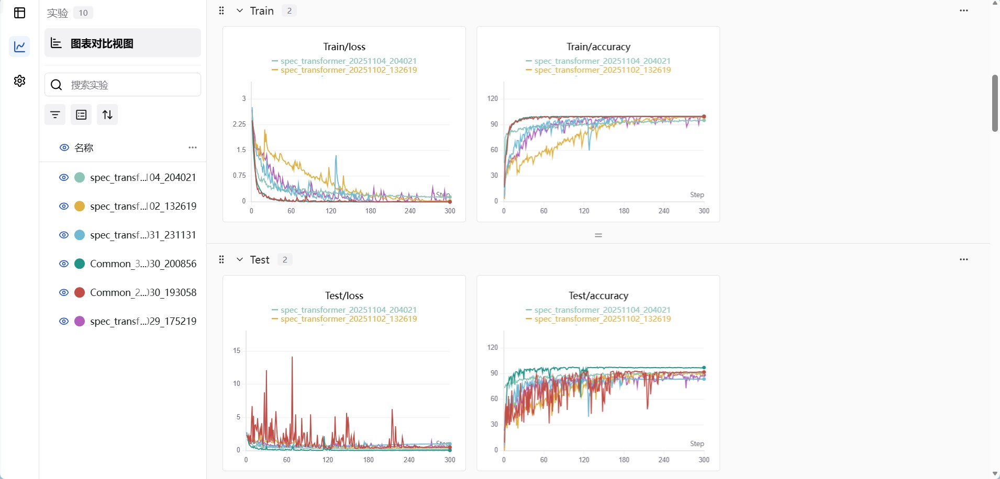
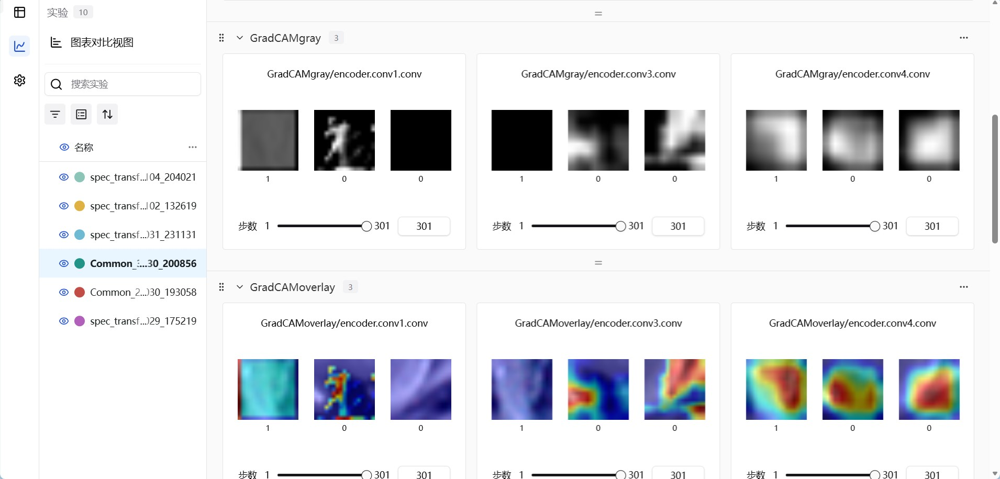
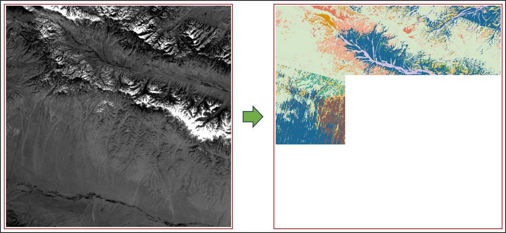
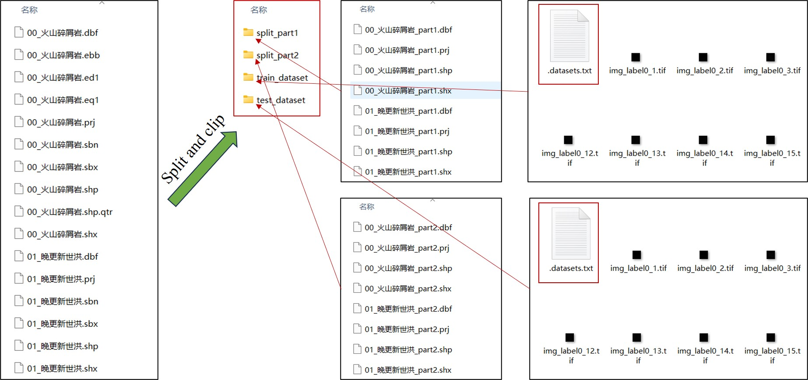

# 🌈 HYSPECTRAL_DL

<div align="center">

**高光谱遥感影像深度学习与对比学习框架**

*A Deep Learning and Contrastive Learning Framework for Hyperspectral Remote Sensing Image Classification*

[](https://www.python.org/)
[](https://pytorch.org/)
[](LICENSE)
[](https://gdal.org/)

</div>

## 📖 简介

**HYSPECTRAL_DL** 是一个专为高光谱遥感影像分析设计的端到端深度学习框架，特别针对岩性分类、地物识别等地质应用场景进行优化。该框架集成了**对比学习**与**监督学习**两大范式，提供了从样本裁剪、模型训练到大幅高光谱影像预测的完整工作流。

### 🎯 核心特性

#### 🔥 对比学习框架
- **端到端对比学习 (End-to-End)**：基于 SimCLR 思想的完全端到端训练
- **动量对比学习 (MoCo)**：支持大型特征队列的高效对比学习
- **自动数据增强**：专为高光谱数据设计的光谱掩码、波段丢弃等增强策略
- **无标签预训练**：充分利用大量无标签高光谱数据进行特征学习

#### 🚀 深度学习模型库
内置多种主流高光谱深度学习模型

#### 🖥️ 多 GPU 训练支持
- **DataParallel**：简单易用的多卡并行训练
- **自动设备管理**：智能检测 GPU 数量并分配资源

#### 📊 实验管理与可视化
- **SwanLab 集成**：完整的实验跟踪和管理系统，[SwanLab官方网站](https://swanlab.cn/)
- **实时监控**：训练过程中的损失、准确率、学习率等指标实时可视化

- **Grad-CAM**：类激活映射可视化，解释模型决策过程，支持自定义层的特征图绘制与分析


#### 🗺️ 大幅影像智能预测
- **滑窗分块预测**：突破内存与显存限制，支持任意尺寸影像预测
- **结果可视化**：自动生成分类结果图和 RGB 合成图，保持分类图坐标信息不变


#### 🛠️ 丰富的工具箱
- 数据集裁剪与切分
- 混淆矩阵生成与精度评估
- 矢栅互转工具
- 高光谱重采样工具
---

## 📦 安装

### 环境要求
- Python >= 3.8
- PyTorch >= 2.6 (需自行安装)
- 其余库见 requirements.txt

### 安装步骤

1. **克隆仓库**
```bash
git clone https://github.com/Yonas-Xin/Hyspectral_DL.git
cd Hyspectral_DL
```

2. **安装 PyTorch**（根据您的 CUDA 版本）
```bash
# CUDA 11.8
pip install torch torchvision torchaudio --index-url https://download.pytorch.org/whl/cu118

# CUDA 12.1
pip install torch torchvision torchaudio --index-url https://download.pytorch.org/whl/cu121

# CPU only
pip install torch torchvision torchaudio
```

3. **安装 GDAL**（推荐使用 conda）
```bash
conda install -c conda-forge gdal=3.11.0
```

4. **安装其他依赖**
```bash
pip install -r requirements.txt
```

---

## 🚀 快速开始

### 1️⃣ 对比学习预训练

#### 无需标签数据
对比学习框架支持直接从原始高光谱影像学习特征表示：

```python
# contrastive_learning/Train.py

# 选择训练模式
TRAIN_MODE = "ETE"  # 或 "MOCO"
encoder_model_name = 'SSRN'

# 数据配置
DATA_MANAGE_MODE = 2  # 自动从影像裁剪并组织无标签样本
images_dir = r'path/to/hyperspectral_images'
patch_size = 17

# 对比学习参数
K = 65536  # 负样本队列大小 (MoCo)
m = 0.999  # 动量更新系数 (MoCo)
T = 0.07   # 温度参数

# 多 GPU 训练
USE_DATA_PARALLEL = True
```

运行预训练：
```bash
python contrastive_learning/Train.py
```
### 2️⃣ 监督学习训练
#### 样本裁剪
提前准备样本圈定的**矢量文件**（面矢量或者点矢量，放在**同一文件夹**）与**高光谱影像**
- **样本集随机划分**：自动划分训练集与测试集
- **样本集裁剪**：裁剪样本并以txt格式存储样本路径

运行脚本：
```python
# toolbox/split_and_clip_dataset.py

# 配置输入与输出文件
input_tif = r'.\test.dat'
input_shp_dir = r'.\shp_dir'
output_dir = r'c:\out_dir'

# 配置裁剪参数
num_to_select = 0.6 # 分割比例
block_size = 17 # 样本块大小
```

#### 数据准备
支持两种数据格式：
- **TIF/DAT 格式**：标准遥感影像格式
- **数据集列表文件**：`.datasets.txt` 文件，每行包含 `影像路径 标签`

#### 训练脚本
```python
# cnn_model/Train.py

# 选择模型
model_selected = 'SSRN'  # 或 'ResNet50', 'HybridSN' 等

# 配置数据集
train_images_dir = r'path/to/train_dataset/.datasets.txt'
test_images_dir = r'path/to/test_dataset/.datasets.txt'

# 训练参数
epochs = 100
batch = 64
init_lr = 3e-4
warm_up_epochs = 10

# 预训练模型路径*.pth（可选）
pretrain_pth = None

# 多 GPU 训练
USE_DATA_PARALLEL = True  # 自动检测并使用多 GPU
```

运行训练：
```bash
python cnn_model/Train.py
```

### 3️⃣ 大幅影像预测

```python
# cnn_model/Predict.py

# 输入配置
input_data = r"path/to/large_hyperspectral_image.dat"
model_pth = r"path/to/trained_model.pt"
output_path = 'classification_result.tif'

# 预测参数
batch = 128
image_block_size = 512  # 分块大小，根据显存调整
DRAW_RGB = True  # 生成 RGB 可视化
```

运行预测：
```bash
python cnn_model/Predict.py
```

## 📂 项目结构示意

```
Hyspectral_DL/
├── cnn_model/                # 监督学习模块
│   ├── Models/                 # 模型定义
│   │   ├── Models.py             # 深度学习模型
│   │   ├── Data.py               # 数据加载器
│   │   ├── Frame.py              # 训练框架
│   │   └── Scheduler.py          # 学习率调度器
│   ├── Train.py                # 训练脚本
│   ├── Predict.py              # 预测脚本
│   └── _results/               # 训练输出目录
│
├── contrastive_learning/     # 对比学习模块
│   ├── Models/                 # 模型定义
│   │   ├── Models.py             # ETE/MoCo 模型
│   │   ├── Encoder.py            # 编码器
│   │   ├── Feature_transform.py  # 数据增强
│   │   ├── Data.py               # 数据管理
│   │   └── Frame.py              # 训练框架
│   ├── Train.py                # 对比学习训练脚本
│   └── _results/               # 训练输出目录
│
├── toolbox/                  # 工具箱
│   ├── clip_dataset.py           # 数据集裁剪
│   ├── split_and_clip_dataset.py # 数据集切分
│   ├── Confusion_Matrix.py       # 混淆矩阵生成
│   ├── Create_H5.py              # HDF5 数据创建
│   ├── Data_enhance.py           # 数据增强
│   ├── tif2shp.py                # 格式转换
│   └── ......                    ......
│
├── algorithms.py             # 部分算法
├── core.py                   # 核心功能
├── utils.py                  # 通用工具函数
├── gdal_utils.py             # GDAL 工具函数
└── requirements.txt          # 依赖列表
```